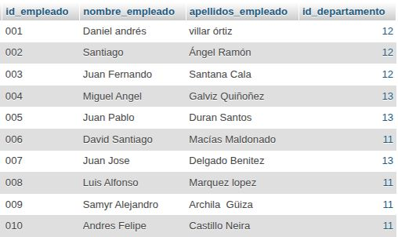
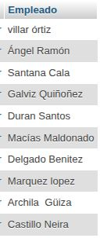
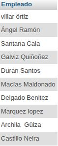
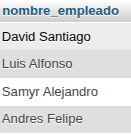
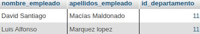

# Consulta2_sql
trabajo de consulta sql, relacionado con los datos de una empresa

## Datos de la empresa 

## Tabla de departamentos

## Tabla de empleados.

## consulta 1

1. Obtener la lista de los apellidos de todos los empleados.

`SELECT apellidos_empleados  AS Empleados FROM Empleados;`

## consulta 2 

2. Obtener los apellidos de todos los empleados sin repeticiones.

`SELECT DISTINCT apellidos_empleados AS Empleados FROM Empleados;`

`nuevo comando DISTINCT: para eliminar filas duplicadas de los resultados de una consulta, mostrando únicamente valores únicos (distintos) de una o varias columnas. Es fundamental para limpiar informes y obtener listas de valores únicos sin repetidos.`

## consulta 3 

3. Obtener todos los datos de los empleados que se apellidan 'Gomez'.

`SELECT * FROM Empleado WHERE apellidos_empleado = 'GOMEZ';`

4. Obtener todos los datos de los empleados que se apellidan "Diaz" y los que se apellidan "Rodriguez".  Usar OR o IN

`SELECT * FROM Empleado WHERE apellidos_empleado = "DIAZ" or "RODRIGUEZ";`

5. Obtener los nombres de los empleados que trabajan en el departamento 11

`SELECT nombre_empleado FROM Empleado WHERE id_departamento = 11;`

6. Obtener todos los datos de los empleados cuyo apellido empiece por 'M'
 
`SELECT * FROM Empleado WHERE apellidos_empleado 
LIKE 'M%';`

7. Obtener el presupuesto total de todos los departamentos.

`SELECT SUM(presupuesto_departamento) AS presupuesto_total FROM Departamento;`
